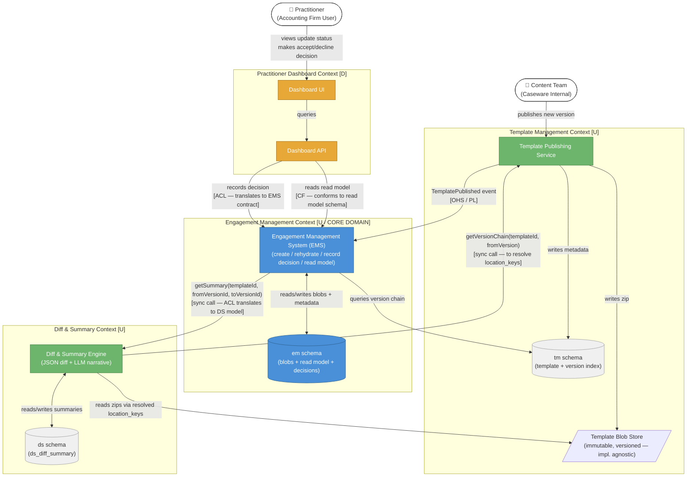

# Context Map

Bounded context relationships for the **Engagement Template Update Management System**.
For terminology see [glossary.md](./glossary.md).
For end-to-end use case walkthroughs see [business-flows.md](./business-flows.md).
For the data model see [erd.md](./erd.md).
For inter-context communication see [communication-patterns.md](./communication-patterns.md).

---

## DDD Relationship Legend

| Label | Meaning |
| :--- | :--- |
| `U` | Upstream — defines the contract, publishes events |
| `D` | Downstream — consumes, adapts to upstream |
| `OHS` | Open Host Service — upstream exposes a stable published API/event contract |
| `CF` | Conformist — downstream accepts upstream model as-is |
| `ACL` | Anti-Corruption Layer — downstream translates upstream model into its own |
| `PL` | Published Language — shared event/message schema both sides agree on |

---

## Diagram

---

## Key Design Decisions Visible in This Map

**EMS is the core domain.**
It owns engagement creation, rehydration, decision recording, the read model, and update decisions — all within the `em` schema. The separate Update Management context was merged into EMS as it owns all three responsibilities per the system spec.

**The Dashboard calls EMS directly for both reads and writes.**
For reads it calls `EngagementQueryService` which reads from `em_engagement_read_model` — no rehydration involved. For writes it calls `EngagementService.recordDecision` via an ACL. EMS is never queried via rehydration from the Dashboard path.

**Template Management uses S3 + the `tm` schema.**
S3 holds the immutable zip archives. The `tm` schema holds the queryable version index with `location_key` pointers. The Diff & Summary Engine reads zips directly from S3.

**Diff & Summary is upstream to EMS.**
Summaries are generated once per `(template_id, from_version_id, to_version_id)` UUID tuple and stored in `ds_diff_summary`. EMS calls `DiffSummaryService.getSummary()` synchronously via an ACL, translating its internal model into the Diff & Summary contract. No events are involved in this flow.

**The Dashboard is a pure downstream conformist for reads.**
It conforms to the read model schema for queries — no translation needed. For writes (decisions) it uses an ACL to translate into EMS's contract.
