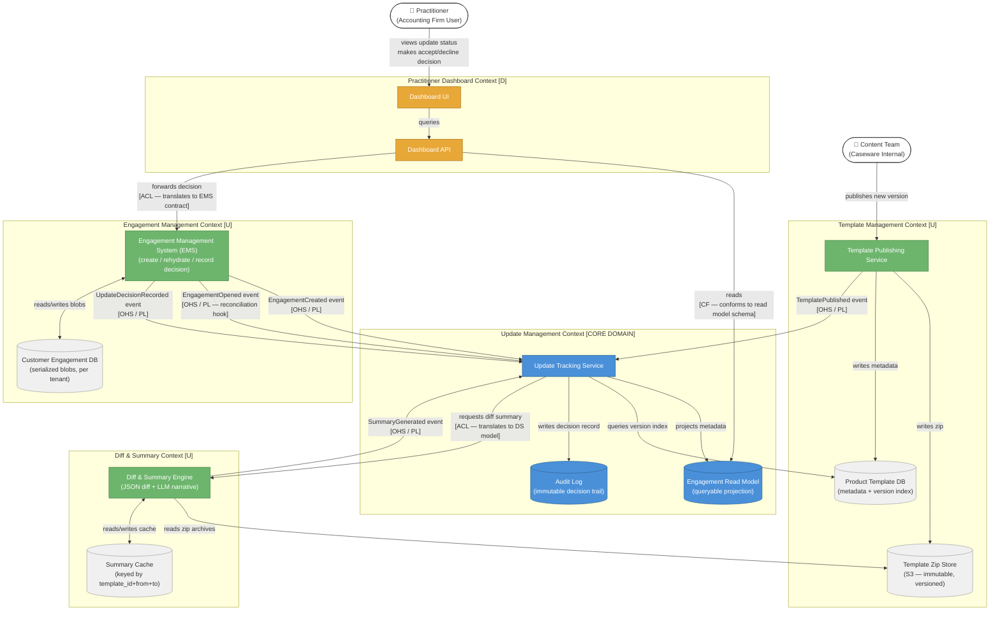

# Context Map

Bounded context relationships for the **Engagement Template Update Management System**.
For terminology see [glossary.md](./glossary.md).
For end-to-end use case walkthroughs see [business-flows.md](./business-flows.md).
For the data model see [erd.md](./erd.md).
For inter-context communication see [communication-patterns.md](./communication-patterns.md).

---

## DDD Relationship Legend

| Label | Meaning |
| :--- | :--- |
| `U` | Upstream — defines the contract, publishes events |
| `D` | Downstream — consumes, adapts to upstream |
| `OHS` | Open Host Service — upstream exposes a stable published API/event contract |
| `CF` | Conformist — downstream accepts upstream model as-is |
| `ACL` | Anti-Corruption Layer — downstream translates upstream model into its own |
| `PL` | Published Language — shared event/message schema both sides agree on |

---

## Diagram

---

## Key Design Decisions Visible in This Map

**Update Management is the core domain.**
It owns no raw data of its own — it projects a read model from upstream events. This keeps it decoupled from both EMS and Template Management.

**EMS is upstream but not queryable.**
The Dashboard never calls EMS directly. It reads from the Engagement Read Model (maintained by Update Management via EMS events) and forwards decisions back to EMS through an ACL. This is the architectural response to the 1-minute rehydration constraint.

**Template Management uses S3 + a metadata DB.**
S3 holds the immutable zip archives (cheap, durable, versioned by key). The Product Template DB holds the queryable index of versions, checksums, and `storage_uri` pointers. The Diff & Summary Engine reads zips directly from S3.

**Diff & Summary is upstream to Update Management.**
Summaries are generated once per `(template_id, from_version, to_version)` tuple and cached. Update Management requests them via an ACL, translating its internal model into the Diff & Summary contract — so neither context leaks into the other.

**The Dashboard is a pure downstream conformist for reads.**
It conforms to the Read Model schema for queries (no translation needed — the Read Model is designed for this consumer). For writes (decisions), it uses an ACL to translate into EMS's contract.
