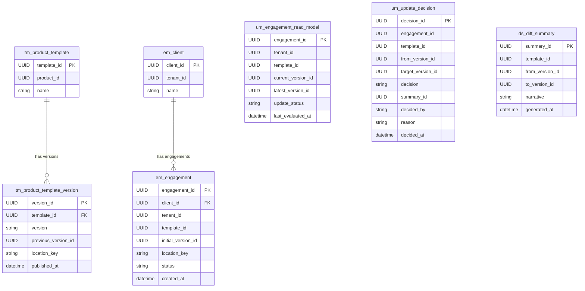

# Entity Relationship Diagram

Data model for the **Engagement Template Update Management System**.
Deployment assumption: **modular monolith** — single database, schema-separated by bounded context.
Cross-context references are correlation IDs only (no enforced FK constraints across schemas).

For terminology see [glossary.md](./glossary.md).
For business flows see [business-flows.md](./business-flows.md).
For the context map see [context-map.md](./context-map.md).

---

## Schema Ownership

| Schema | Bounded Context | Owns |
| :--- | :--- | :--- |
| `tm` | Template Management | Templates and their versions |
| `em` | Engagement Management | Clients and engagement blobs |
| `um` | Update Management | Read model, decisions, audit log |
| `ds` | Diff & Summary | Diff summaries and cache |

> `tenant_id` is a correlation ID sourced from an external identity/auth system — not owned by any schema.

---

## Diagram

---

## Notes

- FK constraints are only enforced **within** the same schema. Cross-schema `template_id`, `engagement_id`, and `tenant_id` fields are correlation IDs kept consistent via domain events, not DB constraints.
- `tenant_id` is sourced from an external identity/auth system — it appears as a correlation ID in `em`, `um`, and `um_audit_log` but is never owned by this system.
- `em_engagement` stores metadata columns plus a `location_key` pointing to the serialized blob in storage. All other engagement state beyond these metadata fields requires rehydration.
- `um_engagement_read_model` is a projection rebuilt from events (`EngagementCreated`, `EngagementOpened`, `UpdateDecisionRecorded`, `TemplatePublished`). It is never the source of truth.
- `um_update_decision` is append-only — no updates or deletes. It serves as the immutable decision trail.
