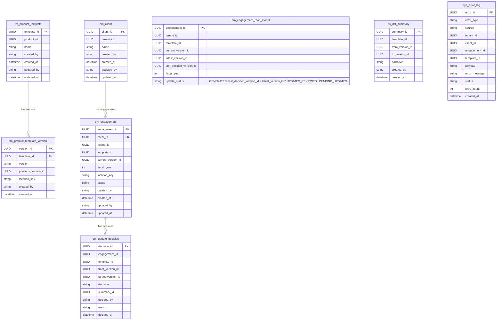

# Entity Relationship Diagram

Data model for the **Engagement Template Update Management System**.
Deployment assumption: **modular monolith** — single database, schema-separated by bounded context.
Cross-context references are correlation IDs only (no enforced FK constraints across schemas).

For terminology see [glossary.md](./glossary.md).
For business flows see [business-flows.md](./business-flows.md).
For the context map see [context-map.md](./context-map.md).

---

## Schema Ownership

| Schema | Bounded Context | Owns |
| :--- | :--- | :--- |
| `tm` | Template Management | Templates and their versions |
| `em` | Engagement Management | Clients, engagement blobs, read model, decisions |
| `ds` | Diff & Summary | Diff summaries |
| `sys` | System / Cross-cutting | Event error log |

> `tenant_id` is a correlation ID sourced from an external identity/auth system — not owned by any schema.

---

## Diagram

---

## Notes

- FK constraints are only enforced **within** the same schema. Cross-schema `template_id`, `version_id`, and `tenant_id` fields are correlation IDs kept consistent via domain events, not DB constraints.
- `location_key` on `tm_product_template_version` and `em_engagement` is a storage-agnostic pointer to the blob (zip archive or engagement file). The backend — object storage, database `bytea`, or filesystem — is an implementation decision.
- `tenant_id` is sourced from an external identity/auth system — it appears as a correlation ID in `em` but is never owned by this system.
- `em_engagement.status` represents coarse lifecycle state only: `ACTIVE`, `ARCHIVED`, `DELETED`. Workflow state lives inside the blob and requires rehydration.
- `em_engagement_read_model` is a projection rebuilt from events (`EngagementCreated`, `UpdateDecisionRecorded`, `TemplatePublished`). It is never the source of truth. `update_status` is derived at read time: `UPDATES_REVIEWED` if `last_decided_version_id == latest_version_id`, else `PENDING_UPDATES`.
- `sys_error_log` captures failures from any system operation (event handlers, LLM calls, blob reads, etc.) with `error_type` identifying the source, `source` the originating component, and `status` values: `PENDING_RETRY`, `FAILED`, `RESOLVED`. A background job retries `PENDING_RETRY` rows. Alerting monitors non-zero `FAILED` count.
